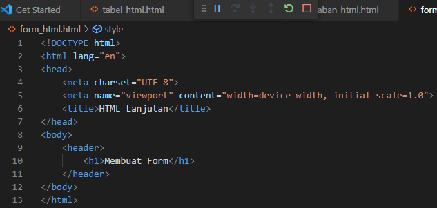
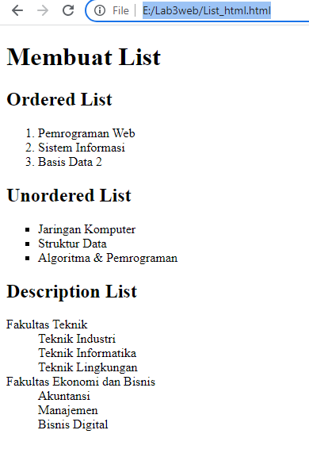
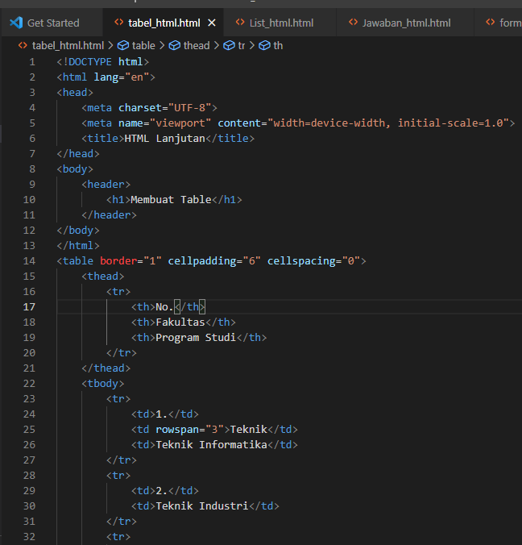
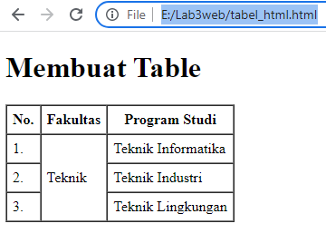
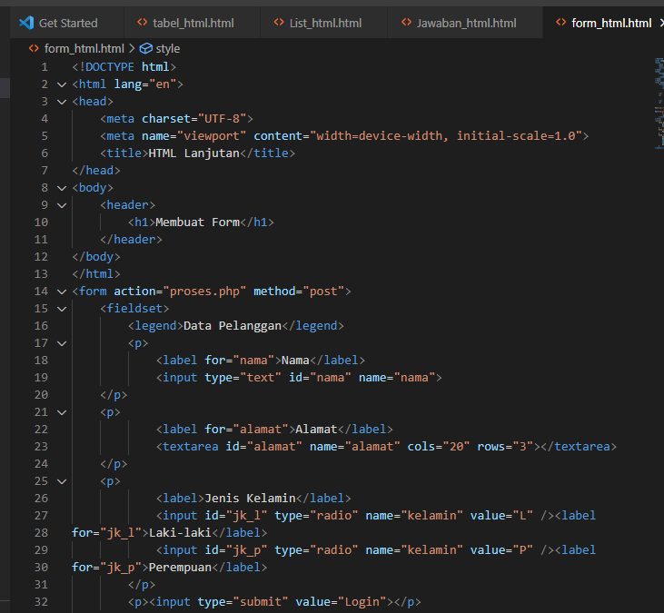
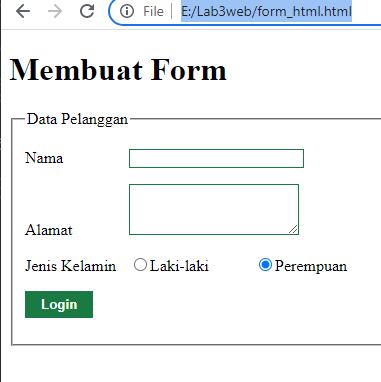

# Lab3web 
untuk memenuhi tugas pemograman web

Nama    : Antini permatasari 
Kelas   : TI.20.B.1 
NIM     : 312010095 

pratikum 3 
## 1. Membuat List HTML
Langka pertama kita buat dulu source code nya dulu : 
 
Dan selanjutnya kita buka browser dan hasilnya seperti dibawah ini : 
 
 
Dengan begitu,sudah selesai kita membuat List Html 

## 2. Membuat Table HTML
Langkah selanjutnya kita akan membuat tabel html, kita buat dulu source code nya : 
 
Dan selanjunya kita buka browser dan hasilnya seperti dibawah ini : 
 
Dengan begitu,sudah selesai kita membuat table html 

## 3. Membuat Form HTML
selanjutnya kita akan membuat form html, kita buat dulu source code nya : 
 
Dan selanjutnya kita buka browser dan hasilnya seperti dibawah ini : 
 

Sekian dari saya,
Semoga Bermanfaat
Terimakasih......

